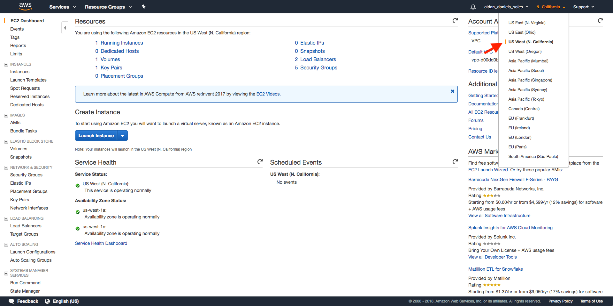
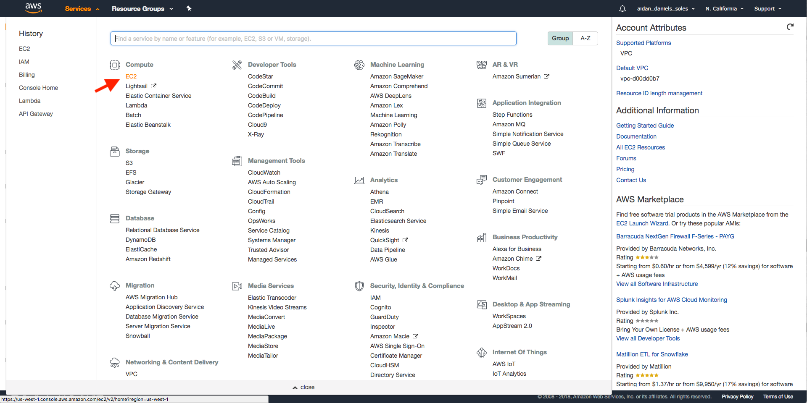
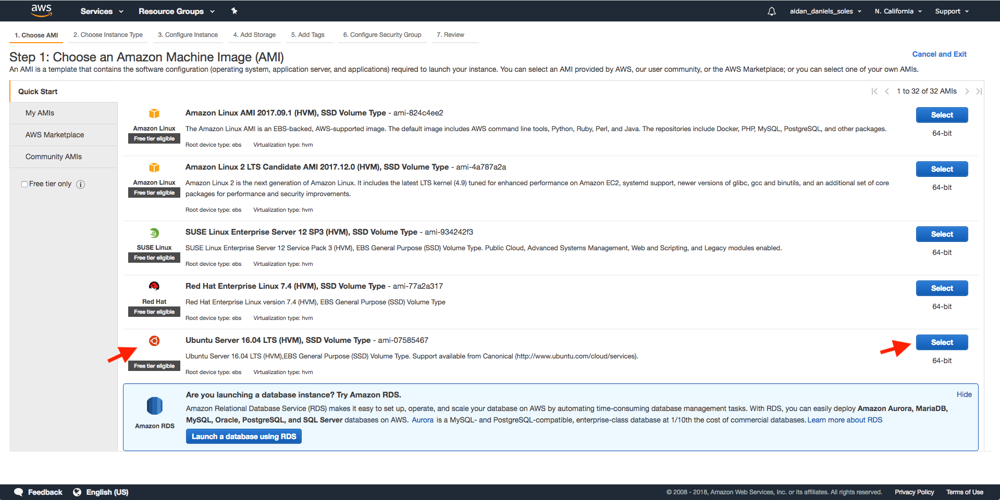
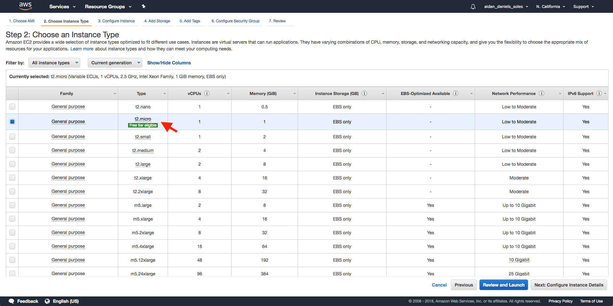
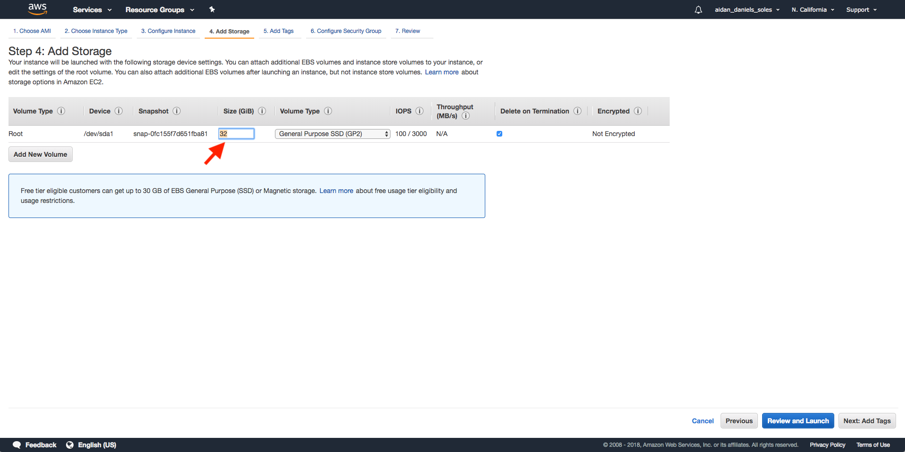
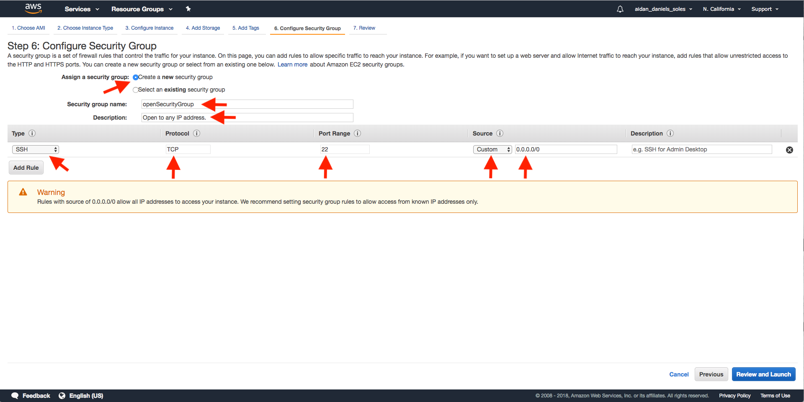
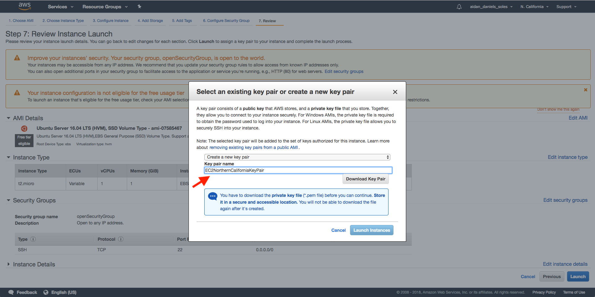
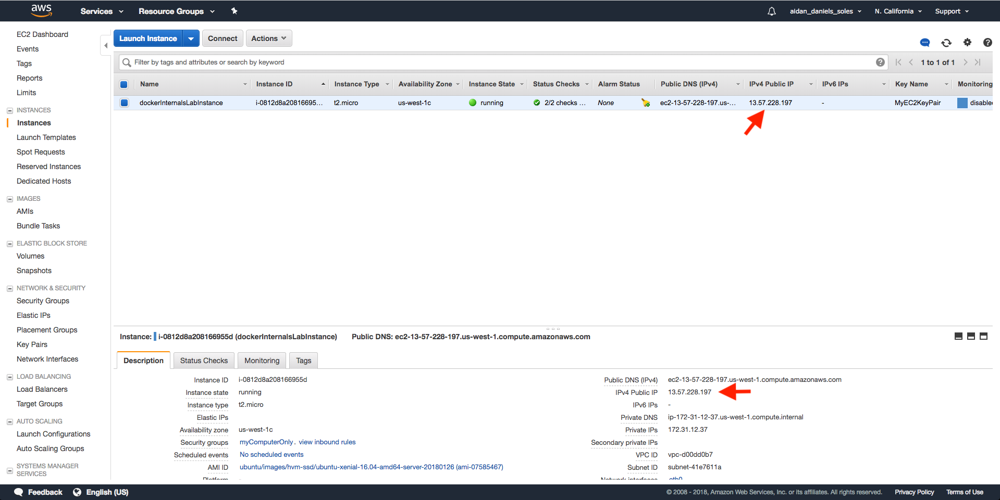

### Lab 1 – Setting Up A Lab VM:

#### Requirements:
* An AWS account (https://portal.aws.amazon.com/billing/signup#/start).
* A terminal environment with SSH capabilities:
    * OSX and Linux: Native.
    * Windows: PuTTY (https://www.putty.org/).

#### Steps:
1. Sign in to the AWS console (https://console.aws.amazon.com).
2. Set your user region to the region that is geographically closest to you (click on the region tab right next to your username in the top right corner of the AWS console and select your desired region):

3. Navigate to the EC2 (Elastic Cloud Compute) dashboard (Services > EC2):

4. Click "Launch Instance".
5. Select the "Ubuntu Server 16.04 LTS (HVM) ..." option:

6. Make sure the "t2.micro" instance type is selected (the free-tier option), and click "Next: Configure Instance Details":

7. Click "Next: Add Storage".
7. Change the size of the "Root" volume type to 32 GiB, then click "Next: Add Tags":

8. Add a tag with the key "name", and value "dockerInternalsLabInstance" (optional, but recommended).
9. Click "Next: Configure Security Group".
10. Select the "Create a new security group" option, then update the security group name to "openSecurityGroup", and the description as "Open to any IP address.". This will create a security group that allows attempted connections from any IP, which, for the purpose of this internal lab, is preferable in case assistance is required (allows both you and potentially your instructor to SSH into the instance). Please note however, that completely open security groups are strongly discouraged in production environments:

11. Make sure the security group has one rule, and that rule's type is "SSH", its protocol is "TCP", its port range is "22", its source is "Custom", and it allows the IP range "0.0.0.0/0". You can add an optional description as well. Click "Review and Launch".
12. You might get the "Improve your instances' security. Your security group, openSecurityGroup, is open to the world." warning. Please disregard this. Click "Launch".
13. When the key pair window pops up, select the "Create a new key pair" option, and name it EC2\<region-name\>KeyPair, where \<region-name\> is the name for the region that you are currently in (key pairs for EC2 are defined within AWS regions). Make sure you download the newly created key pair, and it is in a safe location on your computer:

14. Select the "I acknowledge that I have access to the selected private key file (MyEC2KeyPair.pem), and that without this file, I won't be able to log into my instance." option, the click "Launch Instances". Click "View Instances".
15. Once the "dockerInternalsLabInstance" instance has an Instance State of "running", click on the instance. A description tab should pop up. Find the "IPv4 Public IP" field, and copy down that IP address:

16. Connect to your instance using your recently created key pair:
    * Windows directions: https://linuxacademy.com/howtoguides/posts/show/topic/17385-use-putty-to-access-ec2-linux-instances-via-ssh-from-windows
    * OSX and Linux:
```bash
cd /path/to/folder/with/key/pair
chmod 400 <key-pair-name>
ssh -i <key-pair-name> ubuntu@<public-ip-address>
```
18. Install the required tools:
* Docker:
```bash
$ sudo apt-get update -y
Hit:1 http://us-west-1.ec2.archive.ubuntu.com/ubuntu xenial InRelease
Get:2 http://us-west-1.ec2.archive.ubuntu.com/ubuntu xenial-updates InRelease [102 kB]
Get:3 http://us-west-1.ec2.archive.ubuntu.com/ubuntu xenial-backports InRelease [102 kB]
...
Get:38 http://security.ubuntu.com/ubuntu xenial-security/multiverse Translation-en [1,408 B]
Fetched 24.9 MB in 4s (5,420 kB/s)
Reading package lists... Done
$ curl -fsSL https://download.docker.com/linux/ubuntu/gpg | sudo apt-key add -
OK
$ sudo apt-key fingerprint 0EBFCD88
pub   4096R/0EBFCD88 2017-02-22
      Key fingerprint = 9DC8 5822 9FC7 DD38 854A  E2D8 8D81 803C 0EBF CD88
uid                  Docker Release (CE deb) <docker@docker.com>
sub   4096R/F273FCD8 2017-02-22

$ sudo add-apt-repository \
    "deb [arch=amd64] https://download.docker.com/linux/ubuntu \
    $(lsb_release -cs) \
    stable"
$ sudo apt-get update -y
Hit:1 http://us-west-1.ec2.archive.ubuntu.com/ubuntu xenial InRelease
Hit:2 http://us-west-1.ec2.archive.ubuntu.com/ubuntu xenial-updates InRelease
Hit:3 http://us-west-1.ec2.archive.ubuntu.com/ubuntu xenial-backports InRelease
...
Get:6 https://download.docker.com/linux/ubuntu xenial/stable amd64 Packages [3,150 B]
Fetched 69.0 kB in 0s (200 kB/s)
Reading package lists... Done
$ sudo apt-get install -y docker-ce
Reading package lists... Done
Building dependency tree
Reading state information... Done
...
Processing triggers for libc-bin (2.23-0ubuntu10) ...
Processing triggers for systemd (229-4ubuntu21) ...
Processing triggers for ureadahead (0.100.0-19) ...
$ docker --version
Docker version 17.12.0-ce, build c97c6d6
```

* cgroup-tools:
```bash
$ sudo apt-get install cgroup-tools
Reading package lists... Done
Building dependency tree
Reading state information... Done
...
Processing triggers for libc-bin (2.23-0ubuntu10) ...
Processing triggers for dbus (1.10.6-1ubuntu3.3) ...
Processing triggers for ureadahead (0.100.0-19) ...
```

* cgroup-tools:
```bash
$ sudo apt-get install stress-ng
Reading package lists... Done
Building dependency tree
Reading state information... Done
...
Setting up libaio1:amd64 (0.3.110-2) ...
Setting up stress-ng (0.05.23-1ubuntu2) ...
Processing triggers for libc-bin (2.23-0ubuntu10) ...
```
