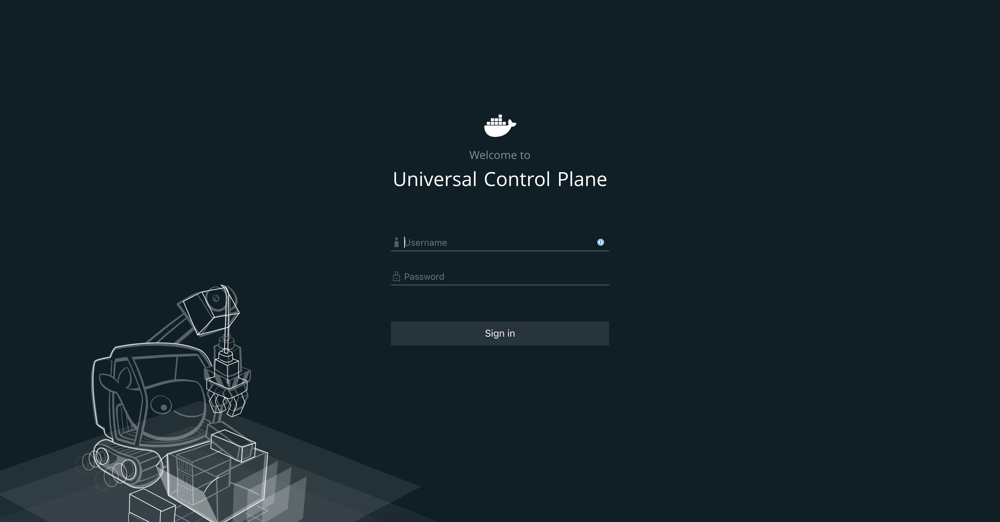
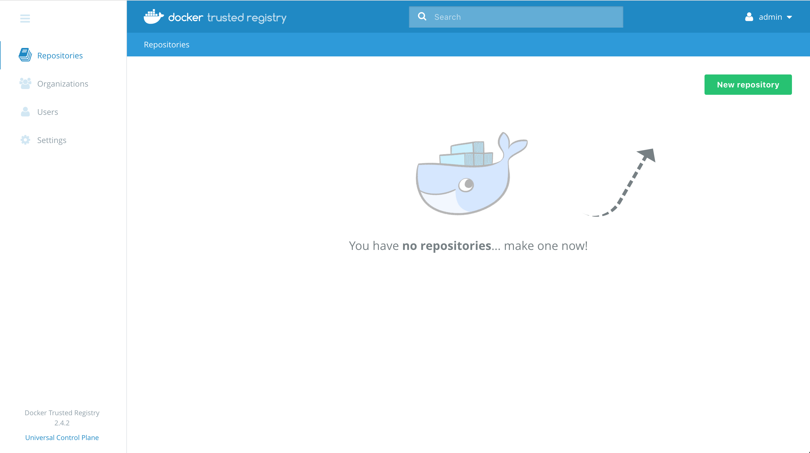

# Docker Datacenter Guide

This walkthrough demonstrates the basic use of Docker Datacenter, and Docker Trusted Registry.

## Content

This welcome guide illustrates the following tasks:

1. Logging into DDC
1. Creating a new user
1. Logging into DTR
1. Deploying an application
1. Deploying a WP site

## Prerequisites

You need the following components to complete this walkthrough:

* Browser (screenshots show Chrome)
* Three node Docker Datacenter (DDC) sandbox in DigitalOcean

> Note: All nodes have the Docker Engine, Universal Control Plane (UCP) and Docker Trusted Registry (DTR) installed.

### Accessing Universal Control Plane

Universal Control Plane can be accessed at `https://<your-ucp-ip>` in your browser. Login with the following credentials:

> Username: admin <br>
> Password: orcaorca

### Accessing Docker Trusted Registry (DTR)

Docker Trusted Registry can be accessed at `https://<your-dtr-ip>` in your browser.

## 1. Logging into UCP

Use a browser to open `https://<your-ucp-ip>`.

### Log into UCP

1. Open `https://<your-ucp-ip>` in a browser.
1. Click "ADVANCED", then "Proceed to ..." to bypass the certificate error page:

1. Use the default admin credentials to login, `username:admin`, `password:orcaorca`:

1. Select "admin" > "My Profile" > "Security" to change the default admin password upon initial login:


## 2. Creating a new user

Use a browser to open `https://<your-ucp-ip>`.

### Create a new user

1. Select the "Create User" button from the "User Management" > "Users" window:

1. Enter the new user information and select "Create" to save:


## 3. Logging into DTR

Use a browser to open `https://<your-dtr-ip>`.

### Log into DTR and create a new repository

1. Open `https://<your-dtr-ip>` in a browser.
1. Use the default admin credentials to login, `username:admin`, `password:orcaorca`.
1. Select "New repository" to create a new repository:


## 4. Deploying an application

The voting application to be deployed is composed of five(5) services:
* Redis
* Postgres (PostgreSQL)
* Worker containers
* Results containers
* Web services

### Deploy an application

1. On your browser, log in to UCP `https://<your-ucp-ip>`.
1. Navigate to the "Stacks" page.
1. Click the "Create Stack" button.
1. Copy-paste the application definition below into the "Compose.yml" section of the form, and name it "voting-app".

```yaml
---
version: "3"

services:
  voting-app:
    image: ehazlett/dockercon-voting-app
    ports:
      - "8000:80"
    networks:
      - voteapp
  result-app:
    image: ehazlett/dockercon-result-app
    ports:
      - "5000:80"
    networks:
      - voteapp
  worker:
    image: ehazlett/dockercon-worker
    networks:
      - voteapp
  redis:
    image: redis
    ports:
      - "6379"
    networks:
      - voteapp
  db:
    image: postgres:9.4
    volumes:
      - "db-data:/var/lib/postgresql/data"
    networks:
      - voteapp
volumes:
  db-data:
networks:
  voteapp:
```

1. Click the "Create" button to create the voting-app application.
1. Once UCP deploys the voting-app application, you can click on the stack, to see its details.
1. Access the voting-app site:
* To vote: `http://<your-ucp-ip>:8000/`
* To view results: `http://<your-ucp-ip>:5000`

## 5. Deploying a WP site

The WordPress application to be deployed is composed of two services:
* WordPress: The container that runs Apache, PHP, and WordPress
* DB: A MySQL database used for data persistence

### Deploy a WP site

1. On your browser, log in to UCP `https://<your-ucp-ip>`.
1. Navigate to the "Stacks" page.
1. Click the "Create Stack" button.
1. Copy-paste the application definition below into the "Compose.yml" section of the form, and name it "wordpress".

```yaml
---
version: '3'

services:
  db:
    image: mysql:5.7
    volumes:
      - db_data:/var/lib/mysql
    environment:
      MYSQL_ROOT_PASSWORD: wordpress
      MYSQL_DATABASE: wordpress
      MYSQL_USER: wordpress
      MYSQL_PASSWORD: wordpress
  wordpress:
    depends_on:
      - db
    image: wordpress:latest
    ports:
      - "8080:80"
    environment:
      WORDPRESS_DB_HOST: db:3306
      WORDPRESS_DB_PASSWORD: wordpress
volumes:
  db_data:
```

1. Select the "Services" mode, then click the "Create" button to create the WordPress application.
1. Once UCP deploys the WordPress application, you can click on the wordpress stack to see its details.
1. Access the WordPress site: `http://<your-ucp-ip>:8080/`.
1. Finish initial configuration by entering the site title, admin username, password and email address.
1. Click the "Install WordPress" button to finish.

## Next steps

This walkthrough shows the basics of using DDC. Up next, we will deploy an application from the CLI.

## See also

[https://docs.docker.com/datacenter/ucp/2.1/guides/user/services/deploy-app-cli/](https://docs.docker.com/datacenter/ucp/2.1/guides/user/services/deploy-app-cli/)
